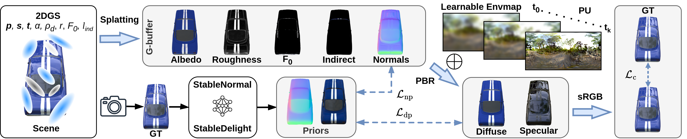

# Spec-Gloss Surfels and Normal–Diffuse Priors for Relightable Glossy Objects
Georgios Kouros, Minye Wu, Tinne Tuytelaars

| [Project page](https://gkouros.github.io/projects/SpecGloss-GS/) | [Full paper](https://arxiv.org/abs/2510.02069) | [Video](https://www.youtube.com/watch?v=Wo4CBEQQyWc) |

**This repository contains the official implementation of the paper "Spec-Gloss Surfels and Normal–Diffuse Priors for Relightable Glossy Objects" presented at WACV 2026 (oral).**

## Abstract
Accurate reconstruction and relighting of glossy objects remains a longstanding challenge, as object shape, material properties, and illumination are inherently difficult to disentangle. Existing neural rendering approaches often rely on simplified BRDF models or parameterizations that couple diffuse and specular components, which restrict faithful material recovery and limit relighting fidelity. We propose a relightable framework that integrates a microfacet BRDF with the specular-glossiness parameterization into 2D Gaussian Splatting with deferred shading. This formulation enables more physically consistent material decomposition, while diffusion-based priors for surface normals and diffuse color guide early-stage optimization and mitigate ambiguity. A coarse-to-fine environment map optimization accelerates convergence, and negative-only environment map clipping preserves high-dynamic-range specular reflections. Extensive experiments on complex, glossy scenes demonstrate that our method achieves high-quality geometry and material reconstruction, delivering substantially more realistic and consistent relighting under novel illumination compared to existing Gaussian splatting methods.

## Pipeline

Overview of our method's pipeline built on 2DGS. Gaussian splats rasterize to a G buffer of albedo, roughness, F0, indirect color, and surface normals. A differentiable prefiltered environment cubemap with mipmaps provides lighting in a physically based deferred renderer. The HDR environment map is learned in a coarse-to-fine manner. Supervision uses an sRGB photometric loss between shaded output and ground truth (GT), plus normal and diffuse priors that reduce ambiguity between geometry, materials, and lighting.

## Installation Instructions
```bash
conda env create -f environment.yml
conda activate specglossgs
conda install -c conda-forge open3d=0.18.0 pillow=11.2.1

pip install submodules/diff-surfel-rasterization
pip install submodules/fused-ssim
pip install submodules/simple-knn
pip install submodules/raytracing
```

## Datasets
1) Download the datasets [Shiny Synthetic](https://storage.googleapis.com/gresearch/refraw360/ref.zip), [Shiny Real](https://storage.googleapis.com/gresearch/refraw360/ref_real.zip), and [Glossy Synthetic](https://connecthkuhk-my.sharepoint.com/:f:/g/personal/yuanly_connect_hku_hk/EvNz_o6SuE1MsXeVyB0VoQ0B9zL8NZXjQQg0KknIh6RKjQ?e=MaonKe).

2) Convert the glossy dataset to blender format:
```bash
python scripts/nero2blender.py --path ./data/GlossySynthetic
```

3) Download the [normal-diffuse prior images](https://drive.google.com/file/d/1kIDpaumBkZbiswvabnN9DCfYMoadNzaL/view?usp=sharing) generated via [StableNormal](https://github.com/Stable-X/StableNormal) and [StableDelight](https://github.com/Stable-X/StableDelight) for all datasets and put them on the corresponding scene dirs.

4) Arrange the datasets as follows:
```bash
./data/
├── glossy_synthetic/
│   ├── angel/
│   │   ├── rgb/
│   │   ├── StableNormal_rgb/
│   │   ├── StableDelight_rgb/
│   │   ├── StableNormal_images/
│   │   ├── test_transforms.json
│   │   └── train_transforms.json
.   .
.   .
├── ref_shiny/
│   ├── ball/
│   │   ├── train/
│   │   ├── test/
│   │   ├── StableNormal_train/
│   │   ├── StableDelight_train/
│   │   ├── test_transforms.json
│   │   └── train_transforms.json
.   .
.   .
└── ref_real/
    ├── garenspheres/
    │   ├── images/
    │   ├── StableNormal_images/
    │   ├── StableDelight_images/
    │   ├── test_transforms.json
    │   └── train_transforms.json
    .
    .

```

## Evaluation
To evaluate our method run the following commands:
```bash
python scripts/glossy_eval.py --scene=all <exp_name> # choose from {all, angel, bell, cat, horse, luyu, potion, tbell, teapot}

python scripts/shiny_eval.py --scene=all <exp_name> # choose from {all, ball, car, coffee, helmet, teapot, toaster}

python scripts/real_eval.py --scene=all <exp_name> # choose from {all, gardenspheres, sedan, toycar}
```

## Visualization
To visualize a scene, first run the web server with the following command:
```bash
python view.py -m "/path/to/experiment"
```
Then on a web browser go to the following address: https://localhost:8080

## Acknowledgement
We gratefully acknowledge the following works that were instrumental in the development of our method:

- [Ref-Gaussian](https://github.com/fudan-zvg/ref-gaussian)
- [3DGS-DR](https://github.com/gapszju/3DGS-DR)
- [GaussianShader](https://github.com/Asparagus15/GaussianShader)
- [2DGS](https://github.com/hbb1/2d-gaussian-splatting)
- [Raytracing](https://github.com/ashawkey/raytracing)
- [StableDelight](https://github.com/Stable-X/StableDelight)
- [StableNormal](https://github.com/Stable-X/StableNormal)

## BibTeX
```bibtex
@InProceedings{Kouros_2026_WACV,
    author    = {Kouros, Georgios and Wu, Minye and Tuytelaars, Tinne},
    title     = {Spec-Gloss Surfels and Normal-Diffuse Priors for Relightable Glossy Objects},
    booktitle = {Proceedings of the IEEE/CVF Winter Conference on Applications of Computer Vision (WACV)},
    month     = {March},
    year      = {2026},
    pages     = {4417-4426}
}
```
